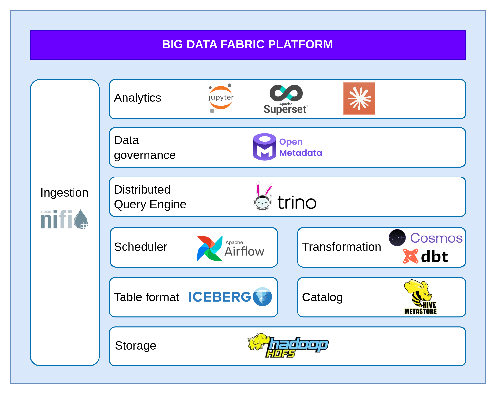

# Big-Data-Fabric-Platform

**Team:** 08 - HotTopic25  
**Project:** UILDING A BIG DATA PLATFORM FOR DISTRIBUTED DATA INTEGRATION USING DATA FABRIC 

---
## Mục tiêu hệ thống 

Dự án **Big-Data-Fabric-Platform** nhằm xây dựng một nền tảng Big Data hoàn chỉnh dựa trên kiến trúc **Data Fabric**, tập trung giải quyết các bài toán:

* Tích hợp dữ liệu **phân tán – dị thể – đa định dạng** (structured, semi-structured, streaming)
* Truy cập dữ liệu **logic thống nhất** mà không cần di chuyển vật lý (zero / minimal copy)
* Quản trị dữ liệu xuyên suốt vòng đời thông qua **Active Metadata & Lineage**
* Tự động hóa pipeline dữ liệu theo hướng **DataOps**
* Hỗ trợ phân tích, BI và mở rộng cho AI/ML

---

## Tổng quan kiến trúc


Hệ thống được xây dựng theo mô hình **Storage – Compute – Governance tách rời**, trong đó:

* **Storage Layer**
  → HDFS + Iceberg (Data Lakehouse)

* **Ingestion Layer**
  → Apache NiFi (Batch + Streaming)

* **Transformation Layer**
  → dbt + Trino (ELT, Medallion Architecture)

* **Query & Virtualization Layer**
  → Trino (Federated SQL Engine)

* **Orchestration Layer**
  → Apache Airflow (Workflow as Code)

* **Governance & Metadata Layer**
  → OpenMetadata (Active Metadata, Lineage, Data Quality)

* **Analytics Layer**
  → Apache Superset (Self-service BI)

Kiến trúc này cho phép:

* Dữ liệu **ở yên tại nguồn**
* Logic xử lý và truy vấn được **ảo hóa**
* Metadata trở thành **trung tâm điều phối thông minh**

---

## Luồng xử lý dữ liệu tổng quát (End-to-End Flow)

```text
[Data Sources]
   ├── Structured (MySQL, PostgreSQL, CSV)
   ├── Streaming (Kafka)
   └── Semi/Unstructured (MongoDB)
        ↓
[Apache NiFi]
        ↓
[HDFS + Iceberg (Bronze / Silver)]
        ↓
[dbt + Trino]
        ↓
[Iceberg Gold Layer]
        ↓
[Superset / BI / Analytics]
        ↓
[OpenMetadata: Lineage + Quality + Governance]
```

---

## Hướng dẫn sử dụng cơ bản

### 1. Khởi động hệ thống 

**Bắt buộc đọc:** `documents/setup.md`

Thứ tự khuyến nghị:

1. Storage (HDFS + Hive Metastore)
2. Trino
3. NiFi
4. Airflow
5. OpenMetadata
6. Superset

---

### 2. Xử lý & biến đổi dữ liệu

* dbt model chạy thông qua Airflow
* Dữ liệu được chuẩn hóa theo:

  * Bronze
  * Silver
  * Gold

---

### 3. Khám phá metadata & lineage

* Truy cập OpenMetadata
* Theo dõi:

  * Data Lineage
  * Data Quality
  * Ownership
  * PII Classification

---

### 4. Phân tích & BI

* Superset kết nối trực tiếp Trino
* Dashboard sử dụng bảng `iceberg.gold.*`

---

## Team & Contact

## 👥 Team 08 – HotTopic25
*Đại học Công nghệ - Đại học Quốc gia Hà Nội (UET-VNU)*

| Thành viên | Vai trò | Liên hệ |
| :--- | :--- | :--- |
| **Khoi Nguyen Phung** | Lead / Data Architect | [pknguyen2704@gmail.com](mailto:pknguyen2704@gmail.com) |
| **Duy Anh Nguyen** | Member | [ngdoanh2004@gmail.com](mailto:ngdoanh2004@gmail.com) |
| **Dinh Hoan Hoang** | Member | [hoandinh040904@gmail.com](mailto:hoandinh040904@gmail.com) |
| **Duc Huy Nguyen** | Member | [huydux2174@gmail.com](mailto:huydux2174@gmail.com) |
| **Quy Lan Luu** | Member | [lanpy2014@gmail.com](mailto:lanpy2014@gmail.com) |
